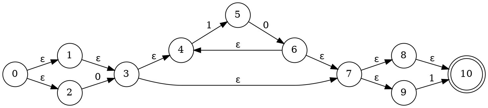
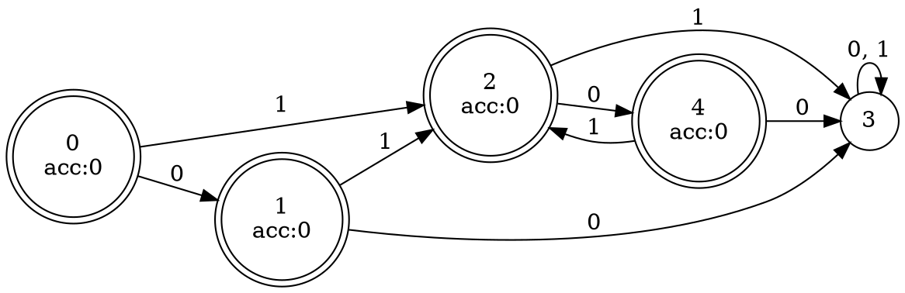
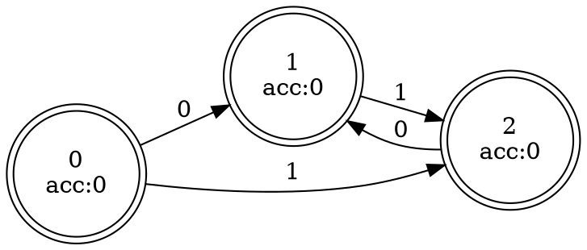

# Features

There were a lot of other components in this repository, including some benchmarks comparing speed with regex, and a `derive` proc macro that works on `enum`. They are now removed because they are actually never used, and maintaining them takes too much time.

Now only the core components of re2dfa are left. The process how re2dfa works is shown in `src/lib.rs`, and each component can also be used separately.

The goal of re2dfa is to convert a set of regexes into a dfa that can be used in the implementation of a compiler's lexer. The effect of this dfa is equivalent to: use all the regexes to match the input string in turn, select the one with the longest match result as the result; if there are multiple results with the same length, select the first regex in these results.

In addition to this core function, the only remaining feature that has no practical use is to show the graphics of nfa or dfa with a `dot` file. An executable named `show_fa` is provided, you can run it with:

```bash
$ cargo run --example show_fa -- --help
```

Or run a specific example, this regex match all strings consisting of alternating 0 and 1:

```bash
$ cargo run --example show_fa -- '0?(10)*1?' --nfa 'a.dot' --raw_dfa 'b.dot' --dfa 'c.dot'
```

The images in `a.dot`, `b.dot` and `c.dot` may look like the following 3 images (for better display effect on this website, I rendered them in the horizontal direction):







Note that in the second image, state 3 is a dead state, which is eliminated in the minimization of dfa.

# Regex

re2dfa supports a subset of regex, here are a few points that fail to meet the regex standards:

1. `{n}`,`{m,n}`,`^`,`$` are not supported. But `{`,`}`,`^`,`$` still need using `\` to escape.
2. `()` has no effect on grouping. Actually we have no concept of grouping.
3. Only support greedy matching. In current implementation, ".*?" can't be parsed.
4. Although `\s`,`\d`,`\w` are supported,`\S`,`\D`,`\W` are not.
5. `.` match all characters, instead of all characters except `\n`. If you want to match all characters except `\n`, please use `[^\n]`.
6. Doesn't support multi-byte character inside `[]`. For example, `[你好]` will be rejected.

There is no guarantee that all other standards in regex are properly implemented, either.

# Character set

re2dfa works on bytes (`u8`) only. However, you can still match a character with multiple bytes. It is just a simple concatenation.

However, items like `\s`,`\d`,`\w` are restricted to ascii. And `.` simply match any byte in `0, 1, ..., 255`.
